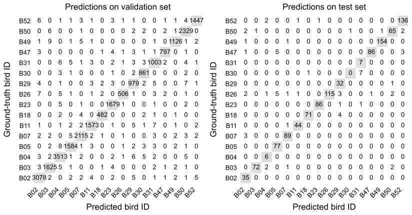

# Automated individual identification of Australian Spotted Bowerbirds 🪶  

## Introduction 📚

The study of a species' behaviour often relies on the analysis of individual subjects, which requires researchers to identify and track specific animals over time. Traditional methods of individual identification include the observation of natural markings or the use of artificial markers such as bands and tags. Video recordings from camera traps have been increasingly used for non-invasive behavioural data collection in ornithological studies. However, processing the large volumes of video data generated by these methods is time- and labour-intensive. Additionally, manually analysing videos to identify marked individuals can be challenging due to physical occlusions of the markers, lighting variations and poor image quality. Developing robust automated methods to analyse such data is crucial to support animals' behavioural research.

The Spotted Bowerbird (Chlamydera maculata) is an excellent model species for developing and validating automated individual identification methods in natural settings. Males build and decorate structures known as bowers, which are crucial for their overall reproductive success. These bowers act as natural focal points, ideal for data collection through camera traps. Moreover, their complex courtship displays and interactions around the bower are individually variable and interesting from a behavioural perspective. 

In this study, we created a pipeline for automated identification of individual Spotted Bowerbirds using camera trap video data collected in the wild. The objectives of this study were (i) to develop a machine learning pipeline for the automated individual identification of bowerbirds from camera trap footage, with an F1-score of 0.85 or above, and (ii) to determine the minimal amount of training data required per individual to achieve this performance with the developed methodology.

Our study demonstrated the feasibility of training a ResNet50 classifier with camera trap footage to identify individual Spotted Bowerbirds, achieving a mean F1-score of 0.9877 on the validation set and a mean F1-score of 0.926 on the test set. This high performance empirically supports the existence of consistent and learnable inter-individual variations in this species. A key finding was that an F1-score of ≥0.85 could be attained with a relatively modest dataset of 400 instances per individual (using a 70:30 training/validation split).

## Dataset 💾

The data was collected by Giovanni Spezie (PhD candidate at the University of Veterinary Medicine Vienna, supervised by Prof. Leonida Fusani) in Taunton National Park (Scientific), Queensland, Australia, during the 2018 breeding season, between July and November. The dataset comprised 76,645 videos, with individual video durations ranging from 30 seconds to 2 minutes. The videos were in the MP4 format, with a resolution of 1920×1080 pixels and a frame rate of 26 frames per second (fps). 

## Structure of the repository

- **`1_Video_filtering/`** →  Logic for filtering out videos from the whole dataset 
- **`2_Video_sampling/`** → Video extraction based on filtering criteria
- **`3_CPU_powered/`** → Data processing Jupyter notebooks.
- **`3_GPU_powered/`** → Data processing Python files. Each file includes a SLURM file needed when running the scripts through scheduled jobs at the VSC.
- **`4_Minimal_training_data/`** → Testing the minimal data needed for classifier training 

## Prerequisites

### Software  👾

One approach is to create a dedicated virtual environment for the project. Dependencies would be installed from the provided requirements.txt file.
```
conda create -n env_name python=version 
conda activate env_name
pip install -r lists compatible versions of all necessary libraries and packages.txt
```

Another approach is to directly install the environment. The required YAML file is also provided.
```
conda env create -f bowerbird_id_env.yml --name your_custom_env_name
```

### Hardware ⚙️

Our ResNet50 model was implemented in PyTorch (1.13.1) and Torchvision (0.14.1). Training was conducted on a computer partition from the Vienna Scientific Cluster, on an NVIDIA A40 GPU (NVIDIA Corporation) and 8 CPU cores from a node equipped with 256 GB of RAM, using the CUDA framework for GPU acceleration on an AlmaLinux (8.5) operating system.

## Data pre-processing 🎞️

Model weights (.pth files) are included when pre-trained models are required. 

### 1. Video filtering 

Ground truth for individual identity was established through manual coding of all recorded videos. This process involved visual inspection to document whether the videos contained visible birds, whether they were banded and unbanded individuals, and to determine the identity of banded individuals. Videos were subsequently filtered from this initial scoring to include only those featuring a single owner bowerbird. 
We excluded videos featuring multiple individuals (banded or unbanded), no birds, single unbanded individuals, individuals of different species, and single banded non-owners. 

### 3.1. Frame sampling

Before frame extraction, a 10% subset of the videos from each bird was held out for testing. Afterwards, frames from the remaining videos were extracted using the OpenCV library, at a fixed interval. After extracting all possible frames, the extractions are limited to 10 frames per video, using the image similarity index and removing frames where no bird is visible, through a pre-trained YOLOv11 detection model.

### 3.2. Frame processing

A multistage image processing pipeline was applied to the extracted raw frames aiming to standardise the size and position of the bird within the frames.

* Object detection: First, a pre-trained YOLOv11 (Ultralytics) model was used to detect the birds in each frame (Figure 3a). For frames in which a bird was detected, the frame was cropped to the bounding box with the highest confidence score, isolating the detected bird (Figure 3b). Frames in which no bird was detected were excluded from further analysis.

* Cropping of the bird in the image: Crops the frame to keep only the area within the highest-confidence bounding box. 

* Bird masking: If there was a detection, the YOLOv11 segmentation model generates a pixel-wise mask of the bird. The mask is then processed using connected component analysis, which groups neighbouring pixels into distinct regions. Each region should represent a separate detected object. However, sometimes, due to lower-quality detections, parts of an object are detected and masked separately. To reduce these lower-quality detections, the script skips regions of too few pixels (currently MIN_BLOB_PIXELS = 5000). If, after this filtering, no region remains, the frame is skipped. This ensures that only frames with clear, identifiable birds are kept.

* Removing leg bands: Leg bands were removed to prevent them from being identified as features for classification by the classifier. each mask was processed to digitally remove the leg band to prevent the classifier from overfitting the training data. This was done by iterating through each pixel row from the lower one-third portion of the mask, i.e. the fraction of the mask expected to contain the birds' legs, to identify narrow vertical structures, i.e. with a width less than or equal to 100 pixels and setting those regions to the background value (black or '0').

### 3.3. Training-validation data split

This script splits masked bird images into training and validation sets (currently test_size=0.3, therefore there is a 70-30 train-val split). The results of the split are logged in processed_bird_ids.log.

## 3.4. Training and evaluating the classifier 💪🏼

Our ResNet50 model was implemented in PyTorch (1.13.1) and Torchvision (0.14.1). Training was conducted on a computer partition from the Vienna Scientific Cluster, on an NVIDIA A40 GPU (NVIDIA Corporation) and 8 CPU cores from a node equipped with 256 GB of RAM, using the CUDA framework for GPU acceleration on an AlmaLinux (8.5) operating system.

The model was initialised with weights pre-trained on the ImageNet dataset. The final fully connected layer was replaced with a classification head to output 16 classes, corresponding to the individual birds, and used a softmax activation function for probability distribution across classes.

Input images were resized to 512×512 pixels and normalized using the standard ImageNet mean and standard deviation values. During training, data augmentation was applied in the form of random horizontal flips (probability = 0.5). The model was trained using Stochastic Gradient Descent with a momentum of 0.9, an initial learning rate of 1×10−3, and a batch size of 32. The learning rate was reduced by a factor of 0.1 every 7 epochs. The model was trained for a total of 20 epochs, with performance on the validation set monitored after each epoch to select the best performing checkpoint. The entire training process required 298 minutes (~5 hours). This selected model was then used for final evaluation on a test set, obtained from the held-out test videos, corresponding to 10% of the original videos.

The performance of the model was assessed both on the validation and on the test sets, through the F1-score, which is calculated as the harmonic mean of precision and recall, combining the two into a single performance metric. Precision is defined as the ratio of true positives (TP) to the sum of true positives and false positives (FP), and recall , also known as sensitivity, is the ratio of true positives (TP) to the sum of true positives and false negatives (FN). The F1-score performance cutoff of 0.85 was established as a study-specific benchmark, as no single cutoff can be applied across studies.

## 3.5. Running automated classification

The script determines the most likely bird ID by following these steps:

1️⃣ Counting how many times each class is predicted for each frame in a subfolder. If no subfolder is provided but simply frames showing the same bird, all frames are processed as one.

2️⃣ Computing a list of probabilities (confidence scores) assigned to the predicted classes, and summing the confidence scores only for the most common class. The sum is divided by most_common_count to get the average confidence. This provides inforamtion about how sure the model is about its most frequent prediction.

3️⃣ Printing the top 3 most frequently predicted classes and how many frames they were predicted for.
This gives information about whether other birds appear similarly frequently and whether there’s classification uncertainty.

## 4. Minimal training data

To determine the minimal number of instances per individual bird required to achieve an acceptable classification performance, we compared the performance of models trained and validated on an increasing number of instances, i.e. increasingly large subsets. For clarity, each subset refers to the total number of instances per individual. Each subset was further randomly split into training, validation and test subsets, corresponding to 70%, 20%, and 10%, respectively. Data from each subset was used to train and validate the classifier, and the performance of the model was evaluated solely on the validation set, and not on the test set.

## 5. Results 

* Performance of the classifier

The classifier achieved a mean F1-score of 0.9877 on the valdiaiton set, and a mean F1-score of 0.926 on the test set. Birds with fewer training instances showed slightly lower scores. 

Classification report

| Class (bird) | Valid videos | Total frames | Training set | Validation set | Test set | F1-score (Validation) | F1-score (Test) |
|--------------|-------------:|-------------:|-------------:|---------------:|---------:|----------------------:|----------------:|
| B02 | 3 341 | 10 349 | 7 244 | 3 105 | 35 | 0.99 | 0.886 |
| B03 | 1 750 | 5 482 | 3 837 | 1 645 | 77 | 0.99 | 0.960 |
| B04 | 4 333 | 11 806 | 8 264 | 3 542 | 6 | 0.99 | 0.705 |
| B05 | 7 779 | 5 366 | 3 756 | 1 610 | 77 | 0.98 | 0.939 |
| B07 | 3 407 | 7 124 | 4 986 | 2 138 | 92 | 0.99 | 0.962 |
| B11 | 5 606 | 5 319 | 3 723 | 1 596 | 45 | 0.99 | 0.967 |
| B18 | 1 581 | 1 638 | 1 146 | 492 | 75 | 0.97 | 0.966 |
| B23 | 3 291 | 5 627 | 3 938 | 1 689 | 88 | 0.99 | 0.982 |
| B26 | 1 635 | 1 763 | 1 234 | 529 | 131 | 0.97 | 0.935 |
| B29 | 4 476 | 3 356 | 2 349 | 1 007 | 33 | 0.98 | 0.876 |
| B30 | 3 033 | 2 898 | 2 028 | 870 | 8 | 0.98 | 0.875 |
| B31 | 3 940 | 3 445 | 2 411 | 1 034 | 7 | 0.98 | 0.933 |
| B47 | 3 124 | 2 706 | 1 894 | 812 | 95 | 0.99 | 0.945 |
| B49 | 1 826 | 3 821 | 2 674 | 1 147 | 196 | 0.99 | 0.992 |
| B50 | 4 079 | 7 807 | 5 464 | 2 343 | 72 | 0.99 | 0.915 |
| B52 | 1 601 | 4 899 | 3 429 | 1 470 | 140 | 0.99 | 0.968 |
| **Total / Mean** | **54 802** | **83 406** | **58 377** | **25 029** | **1 117** | **0.98** | **0.926** |



* Minimal training data


### 6. Challenges encountered and solutions implemented

### 7. Potential improvements and future work:
* Standardising bird posture: In our current dataset, birds appear in various poses. An approach could be to train a pose estimation model, e.g. through key point detection, to filter frames based on the bird's position, e.g. keeping only frames were the bird's back is visible.
* Leg band removal: Birds' legs are not always positioned vertically in the image. Thus, narrow structure filtering was not always successful, and there are instances where leg bands are still visible. Colour segmentation could be implemented alone or as a separate step to detect coloured bands. This approach was attempted but discarded due to the orange tones present in the background and as part of the bird's body.  A more thorough approach, not so focused on orange tones, may work better, e.g. converting the frames to different colour spaces first and then applying colour segmentation.

