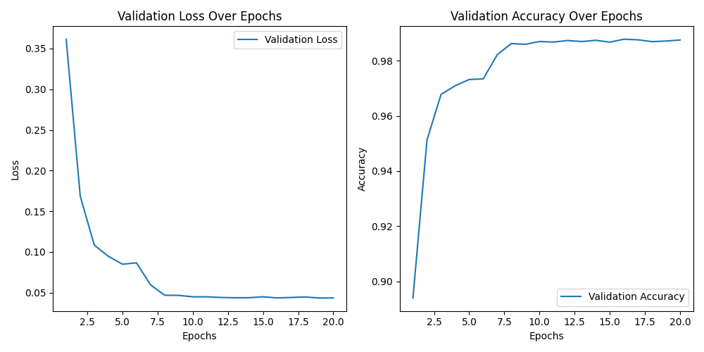
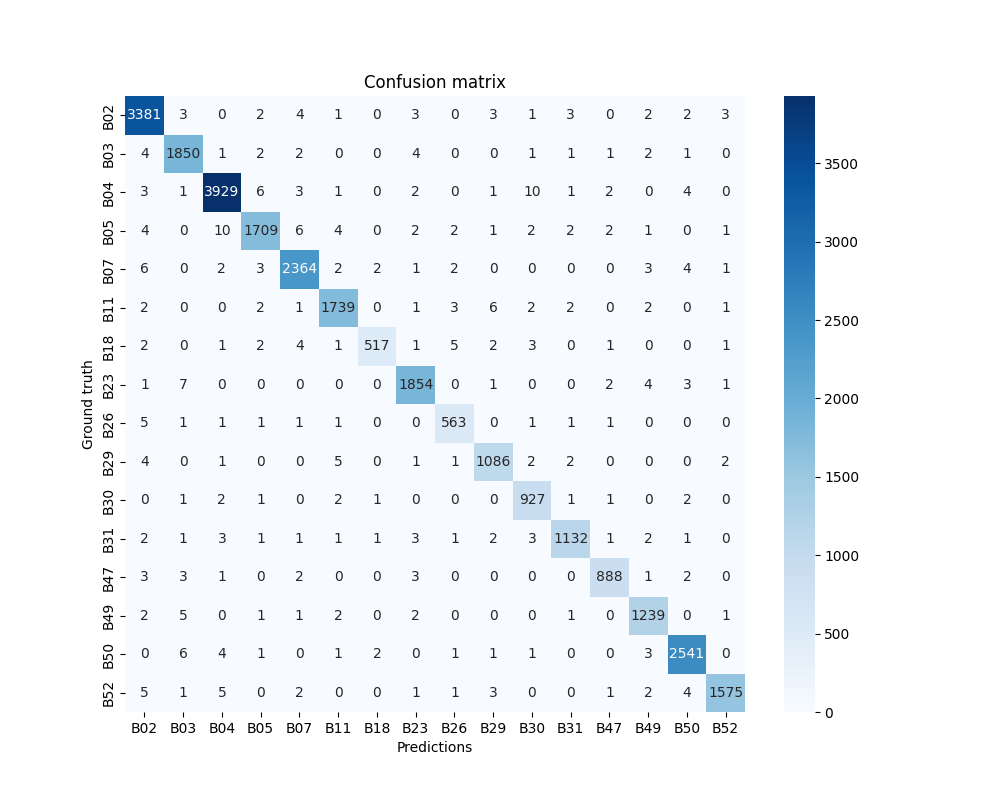

# Bowerbird Individual Identification 🪶  

## Introduction 📚

Since 2018, the Fusani Lab has been filming a population of spotted bowerbirds in Australia. The videos were captured using motion-triggered camera traps placed in front of the bowers, which are structures male bowerbirds build to attract mates. 

Several birds were already identified with uniquely coloured leg bands. However, manually identifying the banded birds is time-consuming and not always possible due to physical occlusions. Besides, may birds, predominantly females, remain unbanded, making it difficult to track their behaviour and interactions over time. Automated identification of individual birds would ease the research of their behaviour. 

This project aimed to automate the identification of individual bowerbirds using machine learning. A ResNet-type algorithm was trained to classify 16 birds on a dataset of video frames from 2018. It achieved a performance of 0.9877 mAP (Mean Average Precision). While this project aimed to identify and classify birds only within the 16 classes, this model could ultimately create new categories for unbanded birds.

This documentation covers: 
* Required environment and dependencies
* Computational resources, with emphasis on accessing the Vienna Scientific Cluster for GPU-powered processing 
* Data pre-processing 
* Model training and validation + How to use the final model
* Lessons learned

## Prerequisites

### Software  👾

A simple approach is to create a dedicated virtual environment, e.g. using conda, to avoid conflicts with other Python projects and install dependencies directly from the requirements.txt file, which lists the compatible versions of all necessary libraries and packages.

```
conda create -n env_name python=version 
conda activate env_name
pip install -r lists compatible versions of all necessary libraries and packages.txt
```
Another approach is to directly install the environment. A YAML file is also provided for that.
```
conda env create -f bowerbird_id_env.yml --name your_custom_env_name
```

### Hardware ⚙️
 
* CPU-powered

During the initial stages of development, the functionality of the scripts was tested on a sample of the data (with up to 50 instances per bird) on a CPU-only machine. 

* GPU-powered

After validation, the scripts were adapted to process the full dataset from 2018, using the computational power from to the Vienna Scientific Cluster (VSC). Detailed information on how to navigate the VSC is included in the supplementary material. 

## Data pre-processing 🎞️

Each script in the featured directory corresponds to a step in the data preprocessing pipeline. Steps 1 and 2 can be run on a CPU. However, in step 3, for CPU-powered processing, scripts are provided as Jupyter Notebook files, which allow for results visualisation during testing. For GPU-powered processing, the scripts are provided as Python files with a matching SLURM file, which is only necessary when running the scritps through scheduled jobs at the VSC. For both approaches, model weights are included as .pth files when pre-trained models are required to run the scripts. 

### Directory Structure

- **`1_Video_filtering/`** →  Logic for filtering out videos from the whole dataset 
- **`2_Video_sampling/`** → Video extraction based on filtering criteria
- **`3_CPU_powered/`** → Interactive data processing for testing (does not require a GPU)
- **`3_GPU_powered/`** → Python files with SLURM job scheduling for processing the full dataset (requires a GPU)  
- **`4_Minimal_training_data/`** → Testing the minimal data needed for classifier training 

### 1. Video filtering 

The script analyses a yearly scoring spreadsheet (currently 2018.xlsx). It outputs the number and IDs of bird individuals identified that year and the "valid videos" count for each bird based on the following inclusion criteria:

* Based on the “Owner” column: Counts “1” (owner of the bower visible), “2” (owner doing bower maintenance); “3” (owner displaying courtship which it can do while alone), or “4” (bird doing maintenance and display). 
* Based on the “Others” column: Counts only “0” (there are no other birds or they are not visible)
* Based on the “Copulation” column: Counts only “0” (no copulation, although this could be inferred if "Others" is "0")

### 2. Video sampling

The reference study captured pictures as the birds sat on a perch, triggered by an RFID identifier attached to each bird. This ensured relatively controlled shots, as the birds were always at a standardised distance from the camera and in a relatively uniform posture. In contrast, we extracted frames from continuous video footage from a motion-triggered camera. This meant that the videos could feature multiple birds or no birds at all, and birds in various postures, performing various behaviours, and at varying distances from the camera. 

To reduce the variation across extracted frames, video sampling was done considering behavioural and contextual criteria from a scoring spreadsheet (`2018.xlsx`). Filtering was applied to ensure that the extracted videos contained only one bird, the owner of the bower. The names of videos that met this criteria were saved in a dictionary as a JSON file (`valid_videos.json`), listing each bird ID along with a corresponding array of video IDs.

### 3.1. Frame sampling

Frames are opened and extracted from the validated videos through OpenCV. The script randomly selects a percentage of the videos (currently 10%) that should be kept for testing, from which frames should not be extracted. Afterwards, it iterates through the remaining videos, sampling frames at a fixed interval (currently 240 frames, the equivalent of 4 seconds). After extracting all possible frames from a video, the extractions are limited to 10 frames per video, using the image similarity index and removing frames where no bird is visible, through a pre-trained YOLOv11 detection model. The extracted frames are written into an output directory, logging the bird ID, video name, and timestamp into a metadata file (`extracted_frames_metadata.csv`). 

### 3.2. Frame processing (Object detection and mask segmentation)

* Object detection: Frames without birds are filtered out first through the same pre-trained YOLOv11 detection model by skipping frames from which no bounding boxes were detected. If there was a detection, the YOLOv11 segmentation model generates a mask of the bird on the detected bounding box. The mask is then processed using connected component analysis, which groups neighbouring pixels into distinct regions. Each region should represent a separate detected object. However, sometimes, due to lower-quality detections, parts of an object are detected and masked separately. To reduce these lower-quality detections, the script skips regions of too few pixels (currently MIN_BLOB_PIXELS = 5000). If, after this filtering, no region remains, the frame is skipped. This ensures that only frames with clear, identifiable birds are kept. 

* Cropping of the bird in the image: It happens immediately after the first YOLO detection step by cropping the frame to keep only the area within the highest-confidence bounding box. This was done to ensure that the birds were uniformly sized in the training data regardless of their position in the scene, e.g. to avoid birds positioned further away from the camera from appearing smaller and to prevent the model from picking up on the birds' size as a feature for classification. 

* Bird masking: It aimed to separate the bird from the background to eliminate noise and artefacts present in the background, thus enhancing the relevant birds' features.

* Removing leg bands: Leg bands were removed to prevent them from being identified as features for classification by the classifier. To remove them, narrow structure filtering was applied, iterating through each pixel row of the frame checking for masked (visible) structures under a certain width (currently set to ≤ 100 pixels). The pixels of these narrow segments are turned black to remove them from the mask. This filtering was only performed in the lower portion of the mask, where legs are expected to be (currently set to the lower 1/3 of the frame).

### 3.3. Training-validation data split

This script splits masked bird images into training and validation sets (currently test_size=0.3, therefore there is a 70-30 train-val split). The results of the split are logged in processed_bird_ids.log.

## 3.4. Training and evaluating the classifier model 💪🏼

Model architecture
Hyperparameters 
Evaluation metrics

## 3.5. Running automated classification

## 3.6. Incremental class learning

## 4. Minimal training data

## 4.1. Subset creation and data split

Creates several training subsets with incremental amounts of data (currenty 50, 100, 150, 200, 250, 300, 350, 400, and 450 instances). There is a random shuffing prior to the selection og images for each subset. In each dataset, there is the same amount of instances per bird, i.e. the trainign + validation sets are now uniform across classes, which was enforced when training with the whole dataset.

Each subset is then split into training (70%), validation (20%), and testing (10%) subsets.

## 4.2. Training the classifier on multiple subsets

Trains a classifier on each subset generated by Split_data.py to evaluate how training performance changes with dataset size and to eventually identify the minimal amount necessary to rain the classifier with an mAP >0.85.

The script separately logs training metrics (loss, accuracy) per epoch, and saves trained models and performance results of eacg subset.

## 4.3. Plotting training progress

This step aiims to visualise the relationship between dataset size and training performance by plotting validation accuracy and loss across dataset size and across epochs. It uses dashed lines for loss and solid lines for accuracy.

## 5. Results 

The best model's accuracy was **0.9877**

Classification report

| Class (bird) | F1-score | Support |
|--------------|----------|---------|
| B02          |  0.99    | 3408    |
| B03          | 0.99     | 1869    |
| B04          | 0.99     | 3963    |
| B05          | 0.98     | 1746    |
| B07          | 0.99     | 2390    |
| B11          |0.99      | 1761    |
| B18          | 0.97     | 540     |
| B23          | 0.99     | 1873    |
| B26          | 0.97     | 576     |
| B29          | 0.98     | 1104    |
| B30          | 0.98     | 938     |
| B31          | 0.98     | 1155    |
| B47          | 0.99     | 903     |
| B49          | 0.99     | 1254    |
| B50          | 0.99     | 2561    |
| B52          | 0.99     | 1600    |

Where:
* Precision: Ratio of correctly predicted positive observations to the total predicted positives.
-  Recall: Ratio of correctly predicted positive observations to the actual positives.
-  F1-score: The weighted average of Precision and Recall.
-  Support: The number of actual class occurrences in the dataset.





### 6. Challenges encountered and solutions implemented

### 7. Potential improvements and future work:
* Standardising bird posture: In our current dataset, birds appear in various poses. An approach could be to train a pose estimation model, e.g. through key point detection, to filter frames based on the bird's position, e.g. keeping only frames were the bird's back is visible.
* Leg band removal: Birds' legs are not always positioned vertically in the image. Thus, narrow structure filtering was not always successful, and there are instances where leg bands are still visible. Colour segmentation could be implemented alone or as a separate step to detect coloured bands. This approach was attempted but discarded due to the orange tones present in the background and as part of the bird's body.  A more thorough approach, not so focused on orange tones, may work better, e.g. converting the frames to different colour spaces first and then applying colour segmentation.

## 8. Supplementary material

### Working on the VSC

Running scripts with GPU support is possible without scheduling jobs and can be done in the following way through the local terminal (it seems not to work on the NoMachine terminal)

### General access to the VSC

resource pool  = VSC-5
login_server   = vsc5.vsc.ac.at
username       = username
project name   = Bowerbird-ID
project_id     = 72607 # This is also the Linux group id, with which folders within the home and data directories are labelled
home directory = /home/fs72607/username          (size is 100.0 GiB)
data directory = /gpfs/data/fs72607/username     (size is 9.8 TiB)

The home & data directories are also available via environment variables: `$HOME` and `$DATA`
The optimal way to copy files into the $DATA directory is using FileZilla
The optimal GUI to explore files on $DATA is NoMachine

1. Activate VPN ()BIG-IP Edge Client: Ensure that the connection is "Full tunnel"

2. In the terminal:
* Access the VSC server through the SSH key:  ```ssh username@login_server```
* Enter the required SSH passphrase
* Enter the OTP (which is sent through SMS)

## Running scripts through VSC's JupyterLab

Move to the  directory where the script to run is
```
cd Bowerbird-ID/3_Frame_sampling
```

## Allocate GPU
The cluster's configuration requires either submitting the job via sbatch or requesting full nodes with GPUs, since salloc cannot allocate partial nodes. 
To request a full node with 2 GPUs: (ONLY ONCE)
```
salloc -N 1 -p zen3_0512_a100x2 --qos zen3_0512_a100x2 --gres=gpu:2

```
Check which node you were allocated.
```
squeue -u $USER

```
SSH into the allocated node
```
ssh n3071-001
```
Load CUDA
```
spack unload
spack load cuda@11.8.0%gcc@9.5.0/ananl33
```
Check whether the GPU is accessible.
```
nvidia-smi
```
## Create an environment on the VSC server

Load the Miniconda module to enable conda commands.
 
```
module load miniconda3
eval "$(conda shell.bash hook)"
```
Activate the Conda environment. 
```
conda activate sarah_env
```

## Schedule job

-   Save the Script as a .slrm file
    
    `nano ~/Bowerbird-ID/3_Frame_sampling/Frame_sampling.slrm` 
    
-   **Submit the Job**:
    
    `sbatch ~/Bowerbird-ID/3_Frame_sampling/Frame_sampling.slrm` 
    
-   **Monitor the Job**:
    
    `squeue -u $(whoami)` 
    
-   **Check Logs**:
    
    bash
    
    Copy code
    
    `less frame_sampling_1.log`

