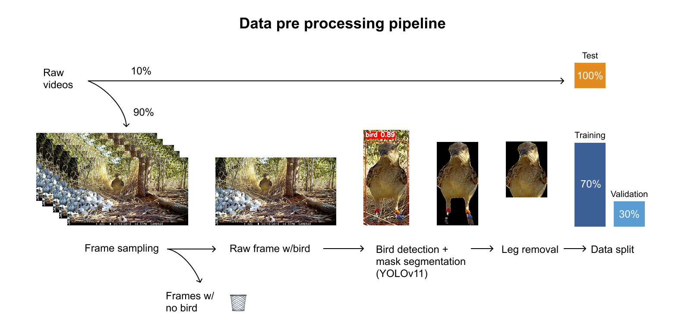
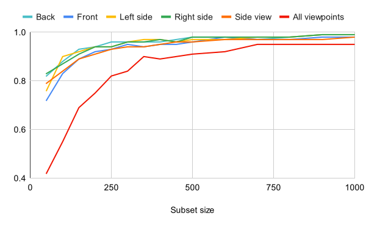

# Automated individual identification of Spotted Bowerbirds 🪶  

📄 **[Download full thesis (PDF)](assets/Individual_ID_thesis_manuscript.pdf)**

## Introduction 

Spotted Bowerbirds (_Chlamydera maculata_) are medium-sized, brown passerines with characteristic spots on their wings and back. Males of this species are known for building and decorating elaborate structures called bowers, which are considered extensions of the males' phenotypes and serve solely for sexual signalling, to attract females. During the breeding season male bower owners spend much of their time in and around their bowers, which makes them ideal focal points for long-term monitoring through camera traps.

Since 2018, the [Fusani Lab](https://fusanilab.org/) has studied a population of banded bowerbirds in Australia using motion-triggered camera traps. Their research has explored topics such as long-term male partnerships (Spezie & Fusani, 2022, 2023), and transfer learning (Knoester et al., 2024). A crucial component of these studies is the reliable identification of individual birds over time. Until now, re-identification has been done manually by visually inspecting videos to observe the birds’ leg bands. Each video is then annotated in a spreadsheet with details such as the individual ID, the displayed behavior, and the number of visible birds. Across three breeding seasons, they collected around 200,000 videos (each lasting 30 seconds to 2 minutes) from approximately 50 individuals. Manually reviewing and annotating this volume of data is extremely time consuming.

To address this challenge, several studies have used Convolutional Neural networks (CNNs) to automate individual re-identification (Li et al., 2019; Ferreira et al., 2020). CNNs are deep learning architectures that learn hierarchical image features, allowing them to recognize subtle and complex patterns (Schmidhuber, 2014), such as  animals' natural markings, that might distinguish an individual from another. 

In this study, we aimed to develop a CNN based pipeline for automatic identification of individual Spotted Bowerbirds from camera trap footage. Specifically, our objectives were to:

1. Train a CNN to identify individual bowerbirds with an F1-score of 0.85 or higher, testing the hypothesis that these birds show enough individual visual variation for reliable identification.
2. Determine the minimal amount of training data required per individual to reach this performance level, to assess the practicality of applying this method to new individuals for whom data is typically limited.
3. Evaluate the impact of viewpoint on the performance of the CNN, hypothesising that side and back viewpoints, where the birds' characteristic spots are visible from, would be more informative for individual recognition.
4. Evaluate the impact of viewpoint on the minimal data requirement, hypothesising that training on only the most informative viewpoints would reduce the amount of data needed per individual to achieve this performance.

## Dataset

All data used in this study was collected by Giovanni Spezie (PhD candidate at the University of Veterinary Medicine Vienna, supervised by Prof. Leonida Fusani) in Taunton National Park (Scientific), Queensland, Australia, during the 2021 breeding season, between July and November. The dataset comprised 76,645 videos, with a total of 16 individual birds. All videos were manually scored by several students prior to the realisation of this study. 

## Structure of the repository

- **`1_Data_processing/`** →  Video filtering, frame sampling, detection and segmentation of the birds, data split
- **`2_Individual_classification/`** →  Training the individual classifier on all available data
- **`3_Minimal_data_requirement/`** → Training the individual classifier on increasingly larger subsets of all available data (50-1000 instances)
- **`4_Viewpoint_classification/`** → Training the viewpoint classifier
- **`5_Viewpoint_and_individual_classification/`** → Training the individual classifier on instances of the birds across each viewpoint
- **`6_Viewpoint_and_data_requirement/`** → Training the individual classifier on increasingly larger subsets of the viewpoint-specific datasets 

## Prerequisites

### Software 

Approach 1: Install dependencies in a dedicated virtual environment from the requirements.txt file.
```
conda create -n env_name python=version 
conda activate env_name
pip install -r lists compatible versions of all necessary libraries and packages.txt
```

Approach 2: Directly install the environment from the bird_id_env.YAML file.
```
conda env create -f bird_id_env.yml --name env_name
```

### Hardware 

Both of our classifiers (individual classifier and viewpoint classifier) were implemented in PyTorch (1.13.1) and Torchvision (0.14.1). Training was conducted on a computer node from the Life Science Compute Cluster (LiSC) with 8 CPU cores and 48 GB of RAM, equipped with an NVIDIA Tesla T4 GPU (NVIDIA Corporation). The system operated under Rocky Linux 9.5 (Blue Onyx), with CUDA support enabled for GPU acceleration.

## 1 - Data pre-processing 🎞️

The dataset was collected by Dr. Giovanni Spezie (former PhD candidate at the University of Veterinary Medicine Vienna, supervised by Prof. Leonida Fusani) in Taunton National Park (Scientific), Queensland, Australia, during the 2021 breeding season, between July and November. Data were gathered using 17 motion-triggered camera traps (Browning, Recon Force Edge) positioned to monitor active bowers owned by previously banded birds, with one camera trap per bower. The dataset comprised 25,234 scored videos, with individual video durations ranging from 30 seconds to 2 minutes. The videos were in the MP4 format, with a resolution of 1920×1080 pixels and a frame rate of 30 frames per second (fps).

### 1.1. Video filtering 

Ground truth for individual identity was obtained from the scoring of all recorded videos, performed by other researchers as part of the larger project. All recorded videos were visually inspected to document whether they contained visible birds, whether they were banded or unbanded, and to determine the identity of banded individuals. Videos were filtered to include only those featuring a single owner bowerbird. The resulting video bank consisted of 24,239 videos of 16 banded owner bowerbirds.

### 1.2. Frame sampling

Before extracting frames, 10% of each bird’s videos were set aside for testing purposes. All frames from these videos were extracted and made up the test set. The remaining videos, i.e. 90% of all raw videos per bird, were processed with OpenCV to sample frames at regular intervals to create the training and validation sets.

### 1.3. Bird detection and segmentation

A multistage image processing pipeline (Fig. 1) was applied to the extracted raw frames aiming to standardise the size and position of the bird within each frame.

* Bird detection: First, a pre-trained YOLOv11 (Ultralytics) model was used to detect the birds in each frame (confidence threshold = 0.8). For frames in which a bird was detected, the frame was cropped to the bounding box with the highest confidence score, isolating the detected bird (Figure 3b). Frames in which no bird was detected were excluded from further analysis.

* Bird mask sementation: Within the detected bounding box, the same YOLOv11 model was applied for mask segmentation (confidence threshold = 0.6), to generate a pixel-wise mask of each bird. Then, the mask was processed with Connected Component Analysis (CCA). To further polish the mask, we skip regions of too few pixels (currently MIN_BLOB_PIXELS = 5000). If, after this filtering, no region remains, the frame is skipped. This ensures that only frames with clear, identifiable birds are kept.

* Leg removal: Each mask was processed to digitally remove the leg band to prevent the classifier from overfitting the training data. This was done by iterating through each pixel row from the lower one-third portion of the mask, i.e. the fraction of the mask expected to contain the birds' legs, to identify narrow vertical structures, i.e. with a width less than or equal to 100 pixels. Pixel rows containing such structures were entirely cropped from the image.

### 1.4. Training-validation data split

The final dataset, consisting of the processed masks for each individual bird, was randomly split into training and validation subsets, with a 70:30 split (Scikit-learn library v1.3.0).

<p align="center">
  
</p>

<p align="center"><em>Figure 1. Data pre-processing pipeline.</em></p>


## 2 - Individual classification 

We used a ResNet50 deep CNN as the individual classifier, with a transfer learning approach. The model was trained on a baseline dataset of 62,198 training and 26,668 validation instances. Input images were resized to 512×512 pixels and normalized using the standard ImageNet mean and standard deviation values. During training, data augmentation was applied in the form of random horizontal flips (probability = 0.5). The model was trained using Stochastic Gradient Descent with a momentum of 0.9, an initial learning rate of 1×10−3, and a batch size of 32. The learning rate was reduced by a factor of 0.1 every 7 epochs. The model was trained for a total of 20 epochs, with performance on the validation set monitored after each epoch to select the best performing checkpoint. The entire training process required 298 minutes (~5 hours). 

After training, the model evaluated on all frames from the held-out test videos (a total of 222,227 frames), at the frame-level (where each frame was an independent prediction instance) and at the video-level (where a single prediction was assigned to the entire video using majority voting of the per-frame predictions). The model achieved a mean F1-score of 0.98 on the validation set, and 0.86 (frame-level) and 0.90 (video-level) on the held-out test set (Table 1).

**Table 1.** Individual classification dataset characteristics and performance.

<div style="font-size: 60%;">

| Bird ID   | Train Set | Validation Set | Test Set | F1-score (Validation) | F1-score (Test, frame-level) | F1-score (Test, video-level) |
|-----------|-----------|----------------|----------|-------------------------|------------------------------|------------------------------|
| BNU-RPM   | 9,916     | 4,250          | 33,276   | 0.99                    | 0.97                         | 0.98                         |
| BNY-RPM   | 595       | 255            | 2,686    | 0.92                    | 0.83                         | 0.89                         |
| BRG-YOM   | 12,971    | 5,560          | 48,033   | 0.99                    | 0.98                         | 0.97                         |
| BRK-NOM   | 1,298     | 557            | 3,441    | 0.90                    | 0.82                         | 0.84                         |
| EYB-RPM   | 8,326     | 3,569          | 28,112   | 0.99                    | 0.97                         | 0.98                         |
| GBM-ORY   | 6,227     | 2,670          | 18,444   | 0.97                    | 0.91                         | 0.95                         |
| GBY-ORM   | 2,831     | 1,214          | 9,356    | 0.98                    | 0.92                         | 0.94                         |
| OEB-RPM   | 3,774     | 1,618          | 16,398   | 0.99                    | 0.90                         | 0.94                         |
| OGY-BRM   | 3,917     | 1,680          | 18,931   | 0.99                    | 0.91                         | 0.94                         |
| ORB-UYM   | 1,738     | 745            | 9,564    | 0.97                    | 0.85                         | 0.89                         |
| OUB-RPM   | 1,417     | 608            | 4,323    | 0.97                    | 0.83                         | 0.87                         |
| OYR-BGM   | 1,790     | 768            | 6,726    | 0.96                    | 0.89                         | 0.92                         |
| RGY-BOM   | 589       | 253            | 1,805    | 0.90                    | 0.47                         | 0.60                         |
| RYO-BGM   | 2,874     | 1,233          | 7,509    | 0.98                    | 0.82                         | 0.92                         |
| YM-OBR    | 1,903     | 816            | 11,565   | 0.98                    | 0.94                         | 0.94                         |
| YRU-POM   | 1,325     | 569            | 2,058    | 0.98                    | 0.84                         | 0.87                         |
| **Total/mean** | **62,198** | **26,668** | **222,227** | **x̄ = 0.98** | **x̄ = 0.86** | **x̄ = 0.90** |

</div>

## 3 - Minimal data requirement 

We compared the performance of fifteen individual classifiers trained and validated on increasingly large data subsets. Subsets contained 50-1000 instances per bird, with increments of 50 instances for subsets with up to 500 instances (50, 100, 150, 200, 250, 300, 350, 400, 450, 500), and subsequent increments of 100 instances for subsets with up to 1000 instances (600, 700, 800, 900, and 1000). These amounts refer to the total number of instances available for a single bird, before training, validation, and test split (70:20:10) (Scikit-learn library v1.3.0). Subsets were created from the full dataset, regardless of viewpoint. The minimal data requirement was defined as the smallest subset size for which the model achieved an F1-score ≥ 0.85 on the validation set. For the first part of the experiment, the subsets were created from the full dataset, regardless of viewpoint. Thus, each subset contained a mixture of viewpoints, as present in the original data distribution. These subsets were created from the whole of the valid videos, without video hold-out for testing. 

**Table 4.** Individual classification performance (F1-score) across subset sizes, per viewpoint.

<div align="center">
  
| Subset size | Front | Back | Left side | Right side | Side view | All viewpoints |
|-------------|-------|------|-----------|-------------|------------|-----------------|
| 50          | 0.72  | 0.82 | 0.76      | 0.83        | 0.79       | 0.42            |
| 100         | 0.83  | 0.88 | 0.90      | 0.87        | 0.84       | 0.55            |
| 150         | 0.89  | 0.93 | 0.92      | 0.91        | 0.89       | 0.69            |
| 200         | 0.92  | 0.94 | 0.94      | 0.94        | 0.91       | 0.75            |
| 250         | 0.93  | 0.96 | 0.94      | 0.94        | 0.93       | 0.82            |
| 300         | 0.95  | 0.96 | 0.96      | 0.96        | 0.94       | 0.84            |
| 350         | 0.94  | 0.96 | 0.97      | 0.96        | 0.94       | 0.90            |
| 400         | 0.95  | 0.96 | 0.97      | 0.97        | 0.95       | 0.89            |
| 450         | 0.95  | 0.97 | 0.96      | 0.96        | 0.96       | 0.90            |
| 500         | 0.96  | 0.98 | 0.97      | 0.98        | 0.96       | 0.91            |
| 600         | 0.98  | 0.98 | 0.97      | 0.98        | 0.97       | 0.92            |
| 700         | 0.97  | 0.97 | 0.98      | 0.98        | 0.97       | 0.95            |
| 800         | 0.97  | 0.98 | 0.98      | 0.98        | 0.97       | 0.95            |
| 900         | 0.98  | 0.99 | 0.99      | 0.99        | 0.97       | 0.95            |
| 1000        | 0.98  | 0.99 | 0.99      | 0.99        | 0.98       | 0.95            |

</div>

<p align="center">
  
</p>

<p align="center">
  <em>Figure 2. Individual classification performance across subset sizes, per viewpoint.</em>
</p>

The trend of increasing performance with more instances was observed across all models, regardless of viewpoint. Classifiers trained on instances of a single viewpoint required between 100 and 150 instances per bird to reach an F1-score of 0.85. In contrast, the classifier trained on data combining all viewpoints required significantly more data, about 350 instances per bird, to achieve the same level of accuracy. Furthermore, the classifiers trained on viewpoint-specific data achieved higher final F1-scores (above 0.97) when trained with larger datasets compared to the model trained on all viewpoints, which reached a maximum F1-score of 0.95.

## 4 - Viewpoint classification

We defined four viewpoints, i.e., front, back, left side, and right side, based on the morphological traits visible from each viewpoint. We first tested whether these viewpoints could be reliably distinguished through an inter-observer reliability (IOR) test, where two human annotators labelled the same randomly selected set of 400 instances. We observed strong agreement between annotators, with 87.25% raw agreement and a Cohen’s Kappa of 0.83, indicating almost perfect agreement (Landis & Koch, 1977). We observed most disagreements occurred between adjacent viewpoints, especially between the "back" and "left side" or "right side". Similarly, the front viewpoint was occasionally confused with "left side"  and "right side". There was no disagreement between opposing viewpoints such as front and back, or left and right viewpoints.

Then, one of the annotators labelled 3000 instances, which made up the training and valdiation sets. We used a ResNet18 CNN as the viewpoint classifier, with a transfer learning approach. The network was initialised with ImageNet-pretrained weights (IMAGENET1K_V1). Input images were resized to 224×224 pixels and normalized using the standard ImageNet mean and standard deviation values. During training, data augmentation was applied in the form of random rotation (±7°) and colour jitter (brightness, contrast, and saturation ±0.15; hue ±0.05). The model was trained using Stochastic Gradient Descent with a momentum of 0.9, an initial learning rate of 1×10−3, and a batch size of 32. The learning rate was reduced by a factor of 0.1 every 7 epochs. The model was trained for a total of 100 epochs, and performance on the validation set was monitored after each epoch.

The viewpoint classifier achieved high performance across all viewpoints (F1-scores between 0.86 and 0.93). Interestingly, the front viewpoint was classified most accurately (F1 = 0.93), despite having the fewest training instances, likely because of distinctive visual features such as the light-colored breast and belly.

**Table 2. Viewpoint dataset characteristics and classification performance**

| Viewpoint  | Train set | Validation set | Test set | F1-score (test set) |
|------------|-----------|----------------|----------|----------------------|
| Front      | 398       | 113            | 58       | 0.93                 |
| Back       | 644       | 84             | 93       | 0.86                 |
| Left side  | 525       | 150            | 75       | 0.88                 |
| Right side | 494       | 141            | 71       | 0.88                 |

## Conclusions

* Individual classification

A deep learning model such as ResNet50 can be trained to reliably distinguish individual bowerbirds on single frames. 
Using majority voting to obtain video-level predictions led to higher overall performance, likely due to reducing the impact of occasional frame-level misclassifications. 
These results provide empirical evidence for the existence of sufficient, consistent, and learnable inter-individual variations in the visual appearance of Spotted Bowerbirds. 

* Minimal data requirement

An F1-score of 0.85 can be achieved with approximately 350 instances perindividual (using a 70:30 training-validation split).
Whenever possible, increasing the number of instances to 900-1,000 might be a better option, as the models trained on these subsets achieved a higher performance (0.9542 F1-score), marginally worse than the baseline model (0.98 F1-score).

* Viewpoint classification

Human annotation of these viewpoints was highly consistent (87.25% raw agreement, Cohen’s Kappa = 0.83).
The viewpoint classifier achieved high performance across all viewpoints (F1-scores between 0.86 and 0.93).
Most classification errors occur when adjacent viewpoint features are visible, e.g., partially turned birds.

* Impact of viewpopint on data requirement

Models trained on a single viewpoint reached the target performance of F1 ≥ 0.85 with only 100–150 instances per bird, whereas the all-viewpoints model required approximately 350 instances per bird. 
Including multiple viewpoints introduces additional visual variability, increasing the complexity of the classification task. Training on a single viewpoint removes this variability and allows the model to learn the discriminative features of each individual more efficiently, requiring less data. 

### Potential improvements and future work

* Leg band removal: Birds' legs are not always positioned vertically in the image. Thus, narrow structure filtering was not always successful, and there are instances where leg bands are still visible. An alternative to our method
could be to train a dedicated object detection model for the automated detection and segmentation of legs and leg bands.

* Implications of training and evaluating the individual classifier on data collected during a single breeding season: Birds' plumage features can change between breeding seasons due to moulting. Consequently, a model trained exclusively on data from one season may not maintain the same accuracy when applied to footage of the same individuals recorded in subsequent years. Future work could test the model's performance on data from different breeding seasons for the same individuals to assess the model's long-term usefulness.

### Ethics

Ethical approval for collection of the data used in this study was obtained from the Animal Ethics Committee of the Department of Agriculture and Fisheries (AEC reference number: CA 2018/04/1185), and field activities at Taunton National Park (Scientific) were approved by Queensland Wildlife and Parks Service (PTU18-001089; NPS18-001090).

### Acknowledgements

This work would not have been possible without the continuous support and feedback provided by Dr. Cliodhna Quigley, Dr. Leonida Fusani, Job Knoester, MSc. and Dr. Giovani Spezie. They were all truly great collaborators.

The computational results of this work have been achieved using the Life Science Compute Cluster (LiSC) of the University of Vienna. Data were collected thanks to a grant of the Austrian Science Fund (FWF: W1262-B29 [https://doi.org/10.55776/W1262]).

This project uses [Ultralytics YOLO11](https://github.com/ultralytics/ultralytics) for detection and segmentation. 

This project uses the scikit-learn library (v1.3.0): Pedregosa et al., "Scikit-learn: Machine Learning in Python", JMLR 12, pp. 2825–2830, 2011.

### References

Ferreira AC, Silva LR, Renna F, Brandl HB, Renoult JP, Farine DR, et al. Deep learning‐based methods for individual recognition in small birds. Methods Ecol Evol. 2020 Sep;11(9):1072–85.   

Knoester J, Spezie G, Mann DC, Fusani L. Do social interactions predict similarities in audio-visual courtship signals in spotted bowerbirds? In: Proceedings of the 10th Convention of the European Acoustics Association Forum Acusticum 2023 [Internet]. Turin, Italy: European Acoustics Association; 2024. Available from: https://dael.euracoustics.org/confs/fa2023/data/articles/000411.pdf 

Landis, J. & Koch, G. The measurement of observer agreement for categorical data. Biometrics. 1977 Mar;33(1):159-74. PMID: 843571.

Li S, Li J, Tang H, Qian R, Lin W. ATRW: A benchmark for Amur Tiger Re-identification in the Wild [Internet]. arXiv [cs.CV]. 2019. Available from: http://arxiv.org/abs/1906.05586

Schmidhuber J. Deep learning in neural networks: An overview [Internet]. arXiv [cs.NE]. 2014. Available from: http://arxiv.org/abs/1404.7828
  
Spezie G, Fusani L. Male-male associations in spotted bowerbirds (Ptilonorhynchus maculatus) exhibit attributes of courtship coalitions. Behav Ecol Sociobiol. 2022 Jul 7;76(7):97. 

Spezie G, Fusani L. Sneaky copulations by subordinate males suggest direct fitness benefits from male-male associations in spotted bowerbirds (Ptilonorhynchus maculatus). Ethology. 2023 Jan;129(1):55–61. 
